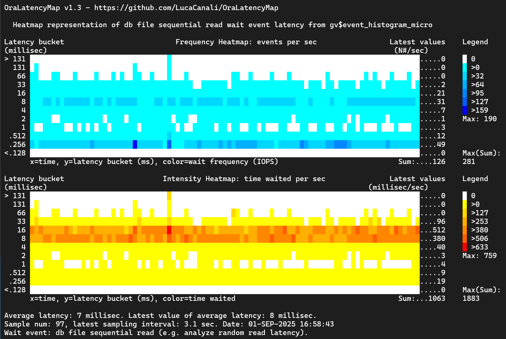

# OraLatencyMap, an Oracle RDBMS Performance Widget

**OraLatencyMap** is a tool to measure and visualize Oracle wait event latencies using **heatmaps**.  
It helps DBAs and performance engineers drill down into Oracle I/O and event latencies to quickly identify anomalies and performance patterns.

---

## ✨ Features
- Visualize Oracle wait event latencies as **heatmaps**.
- Drill down into specific events such as:
  - `db file sequential read` (single block read latency)
  - `log file sync` (commit latency)
- Advanced mode for:
  - Custom sampling time
  - Custom screen size
  - RAC instance/session filtering
- Lightweight SQL*Plus scripts — no database changes required.
- Tested on **Oracle 11g → 19c (Linux x86_64)**.

---

## 📌 Scope
The main use case is **performance investigation of Oracle wait events**, with a focus on **latency distributions**.

Example:
```sql
-- Investigate single block read latency
SQL> @OraLatencyMap 10 "db file sequential read"
```

---

## 👤 Author
**Luca Canali** – [CERN](https://home.cern)  
📧 Luca.Canali@cern.ch

**Version:** v1.2 (March 2014)  
_First release: v1.0 (Aug 2013)_


---

## ⚙️ Requirements
- Run from **SQL*Plus** on a terminal supporting ANSI escape codes.
- Privileged Oracle account with:
    - `SELECT` on `v$event_histogram`
    - `EXECUTE` on `dbms_lock.sleep`

---

## 🚀 Getting Started

```bash
sqlplus / as sysdba
```

Run the script:

```sql
SQL> @OraLatencyMap
SQL> @OraLatencyMap 10 "db file sequential read"
```

### More Examples
```sql
-- Commit time example
SQL> @Example2_commit_time.sql

-- Advanced usage with custom sampling, screen size, and instance filtering
SQL> @OraLatencyMap_advanced 5 "db file sequential read" 12 80 "and inst_id=1"
```

---

## 📊 Output
Each run generates **two latency heatmaps** of the selected wait event:

1. **Waits per second per latency bucket**
2. **Estimated time waited per second per latency bucket**

With the advanced script:
- Customize sampling time, event name, and display size.
- In RAC environments, aggregate across all nodes **or** filter by specific instances/sessions.

---

## 📂 Contents
- `OraLatencyMap_advanced.sql` – Main script for generic latency investigations.
- `OraLatencyMap_internal.sql` – Core engine for computation & visualization.
- `OraLatencyMap_internal_loop.sql` – Runs multiple iterations in a loop.
- `Example*.sql` – Wrapper and example usage scripts.

---

## 📖 Blog entries and References
- [Recent updates of OraLatencyMap](http://externaltable.blogspot.com/2014/03/recent-updates-of-oralatencymap-and.html)
- [Latency Heat Map in SQL*Plus](http://externaltable.blogspot.com/2013/05/latency-heat-map-in-sqlplus-with.html)

- [Oracle DBA scripts](https://github.com/LucaCanali/Oracle_DBA_scripts)
  - In particular, see [ehm_micro.sql](https://github.com/LucaCanali/Oracle_DBA_scripts/blob/master/ehm_micro.sql)

---

## 🙏 Acknowledgements
- **Brendan Gregg** – *Visualizing System Latency*, CACM (July 2010)
- **Tanel Poder** – Snapper, MOATS, SQL*Plus & color hacks
- **Marcin Przepiorowski** – TopasS
- 
---

## 🖼 Example Output


This example shows the latency heatmap for the `db file sequential read` event.  
The system is experiencing a **bimodal latency distribution**, indicating two distinct latency patterns:

- Reads from **fast storage (SSD)** with latency < 1 ms (visible in the *Frequency Heatmap*, blue area).
- Reads from **slower storage (spinning disks)** with latency ≈ 10 ms (visible in the *Intensity Heatmap*, yellow-red areas).

Although most requests are served in under 1 ms, the slower I/Os around 10 ms contribute a significant share of the **total wait time**.

Note you can use [ehm_micro.sql](https://github.com/LucaCanali/Oracle_DBA_scripts/blob/master/ehm_micro.sql) to further analyze the latency distribution:

```
@ehm_micro 10 "db file sequential read"

Latency histograms for Oracle wait events, RAC 12c version.
Usage: @ehm_micro <delta time> <event>
Please wait for 10 sec (DeltaT = 10 sec) for snapshot N.2 and script output.

Latency histogram for event "db file sequential read" from GV$EVENT_HISTOGRAM_MICRO:

Latency Bucket       Num Waits/DeltaT  Wait Time/DeltaT    Event Name                 Last Update Time
(microsec)           (Hz)              (microsec/sec)
-------------------  ----------------  ------------------  -------------------------  -----------------------------------
0 -> 1                              0                   0   db file sequential read
1 -> 2                              0                   0   db file sequential read
2 -> 4                              0                   0   db file sequential read
4 -> 8                              0                   0   db file sequential read
8 -> 16                             0                   0   db file sequential read
16 -> 32                            0                   0   db file sequential read
32 -> 64                            0                   0   db file sequential read
64 -> 128                           0                   0   db file sequential read  28-AUG-25 02.42.52.384106 PM +02:00
128 -> 256                       30.7              5894.4   db file sequential read  28-AUG-25 03.46.59.446425 PM +02:00
256 -> 512                      168.1             64550.4   db file sequential read  28-AUG-25 03.46.59.992706 PM +02:00
512 -> 1024                      16.3             12518.4   db file sequential read  28-AUG-25 03.46.59.959934 PM +02:00
1024 -> 2048                      4.4              6758.4   db file sequential read  28-AUG-25 03.47.00.058773 PM +02:00
2048 -> 4096                      2.2              6758.4   db file sequential read  28-AUG-25 03.47.00.073766 PM +02:00
4096 -> 8192                     11.5               70656   db file sequential read  28-AUG-25 03.46.59.913648 PM +02:00
8192 -> 16384                    53.3            654950.4   db file sequential read  28-AUG-25 03.47.00.070405 PM +02:00
16384 -> 32768                   24.4            599654.4   db file sequential read  28-AUG-25 03.47.00.094237 PM +02:00
32768 -> 65536                    3.8            186777.6   db file sequential read  28-AUG-25 03.46.59.471231 PM +02:00
65536 -> 131072                    .3             29491.2   db file sequential read  28-AUG-25 03.46.56.138750 PM +02:00
131072 -> 262144                   .1             19660.8   db file sequential read  28-AUG-25 03.46.54.536098 PM +02:00
262144 -> 524288                    0                   0   db file sequential read  28-AUG-25 03.45.41.925632 PM +02:00
524288 -> 1048576                   0                   0   db file sequential read  28-AUG-25 12.45.53.293241 PM +02:00
1048576 -> 2097152                  0                   0   db file sequential read  28-AUG-25 12.45.47.509982 PM +02:00
2097152 -> 4194304                  0                   0   db file sequential read  28-AUG-25 12.45.51.772217 PM +02:00
4194304 -> 8388608                  0                   0   db file sequential read  25-MAY-25 12.46.20.207090 PM +02:00
8388608 -> 16777216                 0                   0   db file sequential read  22-APR-25 05.25.45.492753 PM +02:00
16777216 -> 3355443                 0                   0   db file sequential read  22-APR-25 05.25.45.535938 PM +02:00

Average values from GV$SYSTEM_EVENT:

Mean Wait Time       Num Waits/DeltaT  Wait Time/DeltaT    Event Name
(microsec)           (Hz)              (microsec/sec)
-------------------  ----------------  ------------------  -------------------------
4872.1                          315.2           1535701.3  db file sequential read
```
